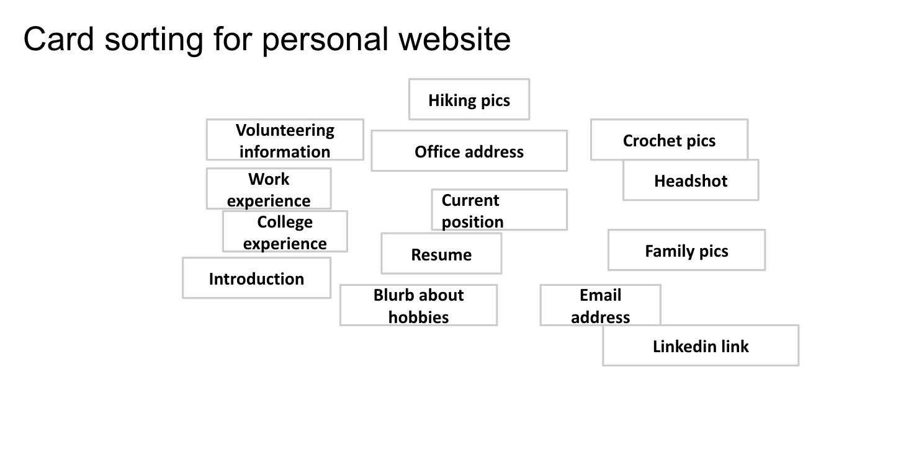
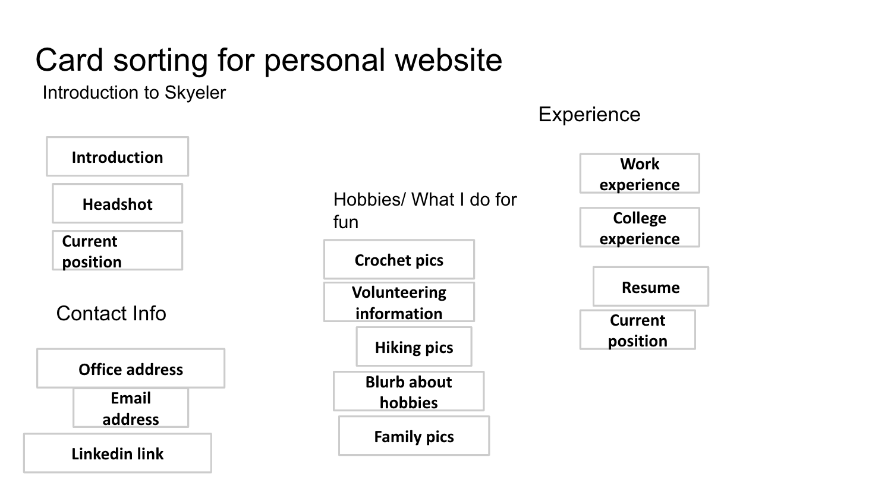
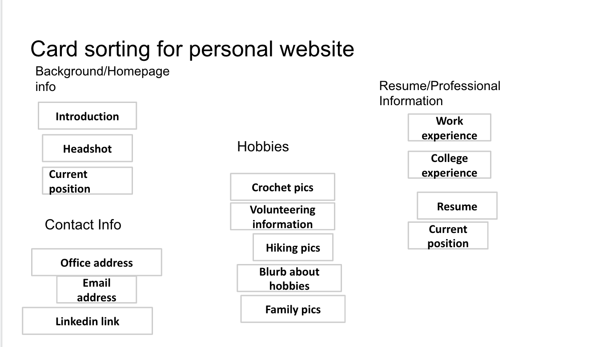
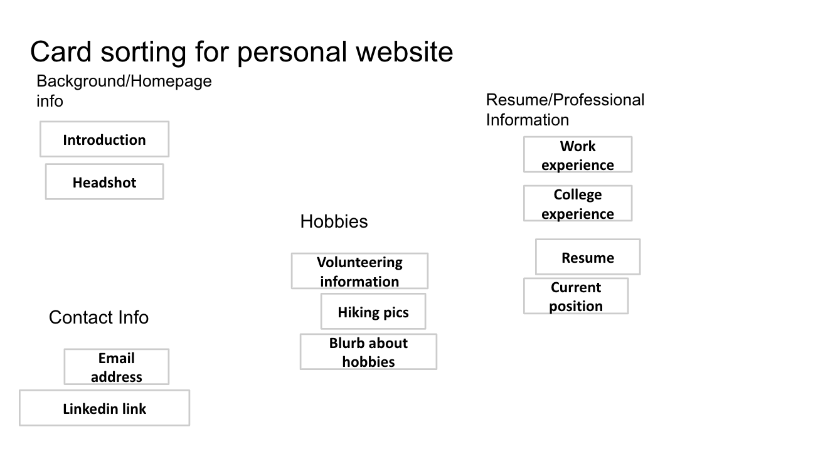

# Project 1: Design Journey

**For each milestone, complete only the sections that are labeled with that milestone.**

Be clear and concise in your writing. Bullets points are encouraged.

**Everything, including images, must be visible in Markdown Preview.** If it's not visible in Markdown Preview, then we won't grade it. We won't give you partial credit either. This is your warning.

## Markdown Instructions

This is a Markdown file. All written documents that you will submit this semester will be Markdown files. Markdown is a commonly used format by developers and bloggers. It's something that you should know. Learning it is a learning outcome of this course.

The following links are Markdown references:
- <https://guides.github.com/features/mastering-markdown/>
- <https://github.com/adam-p/markdown-here/wiki/Markdown-Cheatsheet>

When writing your Markdown file in Atom. Open the command palette and search for **Markdown Preview Plus: Toggle**. This will open up a panel in Atom where you can preview your formatted Markdown file. **The graders will grade you submission in Markdown Preview. All images must be visible in Markdown Preview.**

This is how your insert images into your Markdown documents:

**DELETE THIS SECTION (and example.png) BEFORE THE FINAL SUBMISSION.**

## Audience & Content

**Make the case for your decisions using concepts from class, as well as other design principles, theories, examples, and cases from outside of class.**

You can use bullet points and lists, or full paragraphs, or a combo, whichever is appropriate. The writing should be solid draft quality but doesn't have to be fancy.

**No sketches are required for Milestone 1.**

### Website Topic (Milestone 1)
> Briefly explain what your website will be about.

This will be my professional website, with my professional experience, hobbies and contact information. Employers
will be able to look at this website to learn more about my career and interests. This will be helpful when I am applying to new positions, as they will see that I am competent at using technology and branding myself.

### Audience (Milestone 1)
> Briefly explain who the intended audience(s) is for your website. Be specific and justify why this audience is appropriate for your site's topic.

__Potential Employers__ looking to hire a consultant are the audience for my website. This audience is appropriate as the website will be about my professional career and potential employers would be interested in that information.

### Final Content (Milestone 1)
> Briefly describe the content you plan to include in the final site, and why it's the right content for your audiences.

Previously, I outlined what I wanted to display and now I'll expand upon that.

* __Professional experience:__ This would be the most up to date content on my resume, such as college, past jobs, project experience. This would be relevant fo my audience as potential employers would want to see this information to see if I could be a good fit for their company.
* __Hobbies:__ Most resumes have a hobbies section, as this gives the candidate some humanity as well as something to talk about with their interviewer/recruiter. I will include some of mine, so that potential employers could see what I'm about as a person and get to know me holistically.
* __Contact information:__ This would be my email address and a link to my linkedin. This is relevant for my audience so that they know how to get in touch with me.

### Home Page Content (Milestone 1)
> Briefly identify what content you will include on the homepage and why this content should be the first thing your target audience sees when they visit your site.

On the homepage, I would like the content to be sparse, not overwhelming.
* __Title/My Name:__ This is important as the target audience should know the name of the website they are on.
* __Contact information:__ This should be easily accessible on the front page, so that the target audience can find it without difficulty.
* __Image:__ This would be an image of me, so that the audience can make the connection between my name and face.
* __Introduction:__ This would be a brief introduction to who I am and what my professional interests are, so that the audience knows what the web page is about and why it is useful.

## Information Architecture

**Make the case for your decisions using concepts from class, as well as other design principles, theories, examples, and cases from outside of class.**

Each section is probably around 1 reasonably sized paragraph (2-4 sentences).

**No sketches are required for Milestone 2.**

### Audience (Milestone 2)
> A clearer description of audience: who are they, what are they interested in with respect to this site, and what are the design goals for that audience.

My audience is specifically recruiters/hiring team for consulting firms. They would be interested in my website as I would be a potential candidate for them to hire. The design goals for this audience are easy to navigate, easy to read, contains relevant information about my career and professional interests, and has my contact information easily accessible.

### Organization & Navigation (Milestone 2)
> A description of how you generated and considered alternatives for the site's content organization and navigation. You are required to include images here of your card sorting for determining the organization of content and the navigation.

> Thoroughly document this process. The _process_ is the important part of this assignment, not the final result.]

First, I wrote out all of the possible information I would want to include on my website. I had a lot of ideas so it was messy! Then, I organized them into broad groups. I then tried to title the groups. I ended up re-evaluating my titles and then changing the groups as well. I ended up with Hobbies, Resumé, Background Info, and Contact. Then, I cut down some of the groups, as there were too many ideas and too much content. My final card sorting was the groups shown below.

### Final Organization and Navigation (Milestone 2)
> Explain how the final organization of content and navigation is appropriate for your target audiences.

I have organized my content into 3 pages: Home page, Professional Experience, and Hobbies. My contact info will be on the bottom of all three pages, so that the audience can easily access it.

* My Home Page will have my headshot and an introduction to who I am and what I do. This is appropriate as it is the first thing that a recruiter would want to see when entering a website.
* My Hobbies Page will show my volunteering information, a blurb about what I do for fun, and some pictures of hiking. This is relevant for the audience of recruiters so that they can see whether or not I would be a good fit for the company culture. This will also be helpful for seeing my values.
* My Professional Information Page will have information about my college experience and work experiences. It will also have a link to my resume and a blurb about my current position. This is relevant for recruiters as they would help them see my qualifications and whether I was fit for a certain position.

## Visual Design

**Make the case for your decisions using concepts from class, as well as other design principles, theories, examples, and cases from outside of class.**

Remember to focus on the things we can't see just by looking at the site: changes, alternatives considered, processes, and justifications.

Each section is probably around 1 reasonably sized paragraph (2-4 sentences).

### Theme Ideas (Milestone 3)
> Discuss several ideas about styling your site's theme. Explain why the theme ideas are appropriate for your target audiences. Feel free to include some hand-drawn sketches (not digital drawings, not mock-ups, not wireframes, etc.) here to document your design process.

  I have a few different theme ideas for my website. One of them is a very traditionally classic professional website, with a light blue background and black or dark grey text. I would want the main, big fonts to be sans serif and the body text to be a classic serif, like Times New Roman. This is appropriate for my audience as those cool colors are professional, cool and clean. The fonts are also very professional, hence appropriate for my audience, as they are simple and classic. I also think that the blue fits my "brand" as my name is Skye(ler).

  My second theme idea is a more colorful, confident, and bold, with an off-white background with multicolored text for the title (my name) and black text elsewhere. I would want the title and headers to be in bold, seventies, funky, serif font and the body in a simple, plain sans serif font like ariel. This is appropriate for my audience as it is still simple, but it is bold and would make me appear unique. The fonts are still all easy to read and hence professional, but the colors are bold and high contrast.

### Theme Design (Milestone 3)
> Discuss your theme designs: how did you come to them, what are their strengths and weaknesses, how do they fit your overall design goals and audiences?

My first blue/grey design was inspired by other professional/personal websites I've found online as well as the websites of companies I admire/would want to work for. I think the strengths of this design are the clean-ness and simplicity of the colors and fonts. All of these things fit in with my design goal of being professional, efficient, and clean.
The biggest weakness of this design is that it is kind of boring - it doesn't stand out and isn't very bold. I would worry that it wouldn't make me very memorable and stand out. This wouldn't be beneficial to my goal of making potential recruiters and employers remember me and want to hire me.

My second, colorful and funky design was inspired by a pinterest board I have and a desire to stand out! Also, I looked at one of my TA's websites, and it was much more colorful and professional. The strengths of this design are the boldness, easy to read, and memorable. It conveys some of my personality and values. This would be helpful for my audience to understand my personality, see how bold I am, and be easy to understand. One weakness would be that it might be too colorful and exciting for some more conservative companies. If this website doesn't seem professional, the audience may have reservations about hiring me.

> Emotion is a big part of design. What emotions where you thinking about or trying to convey in your designs?

My blue/grey dsign is trying to evoke the feeling of being calm, organized, and professional.

My colorful design is attempting to evoke the feelings of being boldness, excitement, and organized.

## Rationale

**This rationale should be polished writing: one you might submit as a report to a client or boss to help explain the project and convince them you did a good job. You'll be surprised how much writing and communicating you need to do about projects and choices on internships and jobs; practice that here.**

It should be a comprehensive, complete story of the project. You might find that each section runs a few paragraphs (1-2). Sketches can often help tell the story of your design. Screenshots are also useful for describing issues discovered during the design process and how you addressed them.

**All images must be visible in Markdown Preview for credit!**

Your rationale should be a polished version of the earlier explanations.

### Site Layout (Final Submission)
> Show your design process and final layout for your site. You must include photos of your sketches of the layout. No digital drawings permitted.

> You must label each figure and provide an explanation of the sketch.

Example: (delete this) Sketch for Schedule page (version 1). Users can see a calendar of all bands planing in the main panel. I realized that the layout for the schedule may be confusing. I think separate sections for each day will work better for my audience's needs since they can focus on the bands they want to see for that day.

TODO

### Audience (Final Submission)
> A complete and polished description of the intended audience(s) for your website.

TODO

### Design Goals (Final Submission)
> An explanation of the design goals for that audience, based on your earlier rationales.

TODO

### Navigation (Final Submission)
> An explanation of how the final navigation met your goals and why its appropriate for your audience(s).

TODO

### Organization (Final Submission)
> An explanation of how the final organization met your goals and why its appropriate for your audience(s).

TODO

### Visual Design (Final Submission)
> An explanation of how the final design met your goals and why its appropriate for your audience(s).

TODO

### Self-Reflection (Final Submission)
> What did you learn from this assignment? What are some of your strengths and weaknesses?

TODO
