# Project 1: Design Journey

## Audience & Content

**Make the case for your decisions using concepts from class, as well as other design principles, theories, examples, and cases from outside of class.**

You can use bullet points and lists, or full paragraphs, or a combo, whichever is appropriate. The writing should be solid draft quality but doesn't have to be fancy.

**No sketches are required for Milestone 1.**

### Website Topic (Milestone 1)
> Briefly explain what your website will be about.

This will be my professional website, with my professional experience, hobbies and contact information. Employers
will be able to look at this website to learn more about my career and interests. This will be helpful when I am applying to new positions, as they will see that I am competent at using technology and branding myself.

### Audience (Milestone 1)
> Briefly explain who the intended audience(s) is for your website. Be specific and justify why this audience is appropriate for your site's topic.

__Potential Employers__ looking to hire a consultant are the audience for my website. This audience is appropriate as the website will be about my professional career and potential employers would be interested in that information.

### Final Content (Milestone 1)
> Briefly describe the content you plan to include in the final site, and why it's the right content for your audiences.

Previously, I outlined what I wanted to display and now I'll expand upon that.

* __Professional experience:__ This would be the most up to date content on my resume, such as college, past jobs, project experience. This would be relevant fo my audience as potential employers would want to see this information to see if I could be a good fit for their company.
* __Hobbies:__ Most resumes have a hobbies section, as this gives the candidate some humanity as well as something to talk about with their interviewer/recruiter. I will include some of mine, so that potential employers could see what I'm about as a person and get to know me holistically.
* __Contact information:__ This would be my email address and a link to my linkedin. This is relevant for my audience so that they know how to get in touch with me.

### Home Page Content (Milestone 1)
> Briefly identify what content you will include on the homepage and why this content should be the first thing your target audience sees when they visit your site.

On the homepage, I would like the content to be sparse, not overwhelming.
* __Title/My Name:__ This is important as the target audience should know the name of the website they are on.
* __Contact information:__ This should be easily accessible on the front page, so that the target audience can find it without difficulty.
* __Image:__ This would be an image of me, so that the audience can make the connection between my name and face.
* __Introduction:__ This would be a brief introduction to who I am and what my professional interests are, so that the audience knows what the web page is about and why it is useful.

## Information Architecture

**Make the case for your decisions using concepts from class, as well as other design principles, theories, examples, and cases from outside of class.**

Each section is probably around 1 reasonably sized paragraph (2-4 sentences).

**No sketches are required for Milestone 2.**

### Audience (Milestone 2)
> A clearer description of audience: who are they, what are they interested in with respect to this site, and what are the design goals for that audience.

My audience is specifically recruiters/hiring team for consulting firms. They would be interested in my website as I would be a potential candidate for them to hire. The design goals for this audience are easy to navigate, easy to read, contains relevant information about my career and professional interests, and has my contact information easily accessible.

### Organization & Navigation (Milestone 2)
> A description of how you generated and considered alternatives for the site's content organization and navigation. You are required to include images here of your card sorting for determining the organization of content and the navigation.

> Thoroughly document this process. The _process_ is the important part of this assignment, not the final result.]

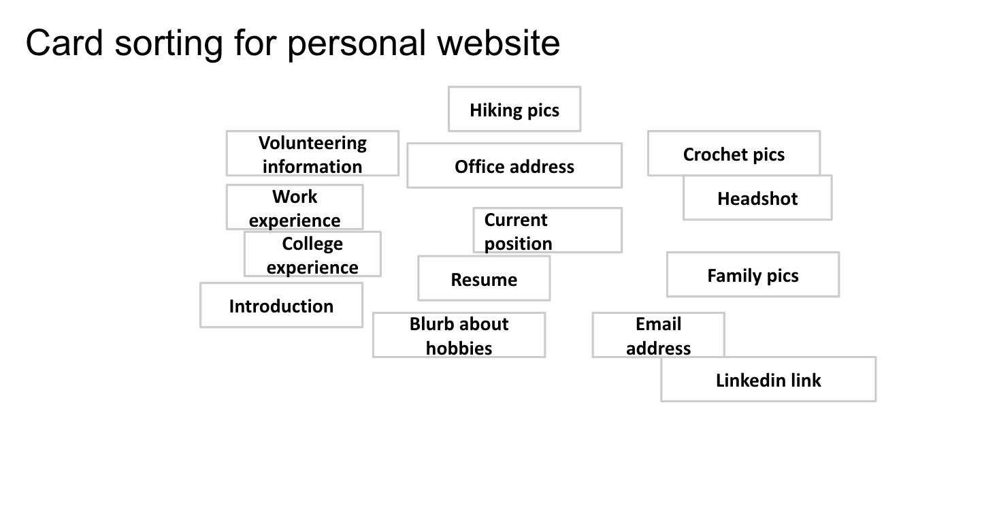

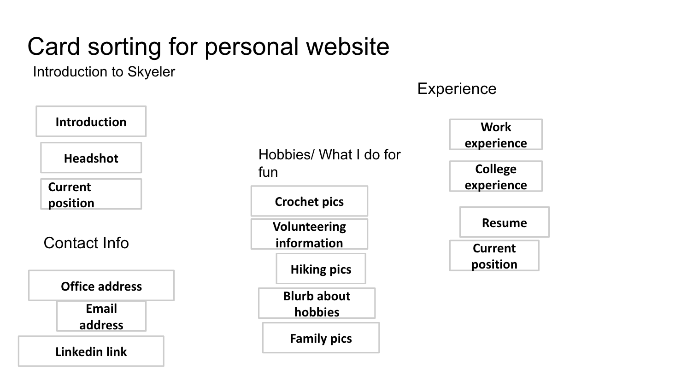

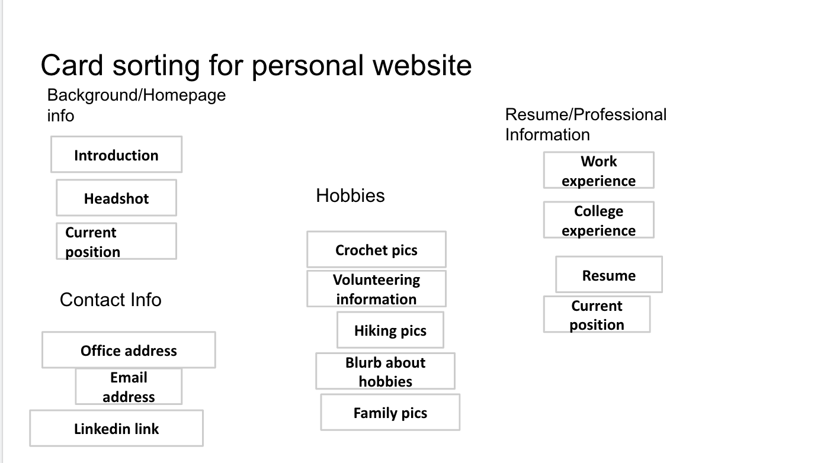

First, I wrote out all of the possible information I would want to include on my website. I had a lot of ideas so it was messy! Then, I organized them into broad groups. I then tried to title the groups. I ended up re-evaluating my titles and then changing the groups as well. I ended up with Hobbies, Resumé, Background Info, and Contact. Then, I cut down some of the groups, as there were too many ideas and too much content. My final card sorting was the groups shown below.

### Final Organization and Navigation (Milestone 2)
> Explain how the final organization of content and navigation is appropriate for your target audiences.

I have organized my content into 3 pages: Home page, Professional Experience, and Hobbies. My contact info will be on the bottom of all three pages, so that the audience can easily access it.

* My Home Page will have my headshot and an introduction to who I am and what I do. This is appropriate as it is the first thing that a recruiter would want to see when entering a website.
* My Hobbies Page will show my volunteering information, a blurb about what I do for fun, and some pictures of hiking. This is relevant for the audience of recruiters so that they can see whether or not I would be a good fit for the company culture. This will also be helpful for seeing my values.
* My Professional Information Page will have information about my college experience and work experiences. It will also have a link to my resume and a blurb about my current position. This is relevant for recruiters as they would help them see my qualifications and whether I was fit for a certain position.

## Visual Design

**Make the case for your decisions using concepts from class, as well as other design principles, theories, examples, and cases from outside of class.**

Remember to focus on the things we can't see just by looking at the site: changes, alternatives considered, processes, and justifications.

Each section is probably around 1 reasonably sized paragraph (2-4 sentences).

### Theme Ideas (Milestone 3)
> Discuss several ideas about styling your site's theme. Explain why the theme ideas are appropriate for your target audiences. Feel free to include some hand-drawn sketches (not digital drawings, not mock-ups, not wireframes, etc.) here to document your design process.

  I have a few different theme ideas for my website. One of them is a very traditionally classic professional website, with a light blue background and black or dark grey text. I would want the main, big fonts to be sans serif and the body text to be a classic serif, like Times New Roman. This is appropriate for my audience as those cool colors are professional, cool and clean. The fonts are also very professional, hence appropriate for my audience, as they are simple and classic. I also think that the blue fits my "brand" as my name is Skye(ler).

  My second theme idea is a more colorful, confident, and bold, with an off-white background with multicolored text for the title (my name) and black text elsewhere. I would want the title and headers to be in bold, seventies, funky, serif font and the body in a simple, plain sans serif font like ariel. This is appropriate for my audience as it is still simple, but it is bold and would make me appear unique. The fonts are still all easy to read and hence professional, but the colors are bold and high contrast.

### Theme Design (Milestone 3)
> Discuss your theme designs: how did you come to them, what are their strengths and weaknesses, how do they fit your overall design goals and audiences?

My first blue/grey design was inspired by other professional/personal websites I've found online as well as the websites of companies I admire/would want to work for. I think the strengths of this design are the clean-ness and simplicity of the colors and fonts. All of these things fit in with my design goal of being professional, efficient, and clean.
The biggest weakness of this design is that it is kind of boring - it doesn't stand out and isn't very bold. I would worry that it wouldn't make me very memorable and stand out. This wouldn't be beneficial to my goal of making potential recruiters and employers remember me and want to hire me.

My second, colorful and funky design was inspired by a pinterest board I have and a desire to stand out! Also, I looked at one of my TA's websites, and it was much more colorful and professional. The strengths of this design are the boldness, easy to read, and memorable. It conveys some of my personality and values. This would be helpful for my audience to understand my personality, see how bold I am, and be easy to understand. One weakness would be that it might be too colorful and exciting for some more conservative companies. If this website doesn't seem professional, the audience may have reservations about hiring me.

> Emotion is a big part of design. What emotions where you thinking about or trying to convey in your designs?

My blue/grey design is trying to evoke the feeling of being calm, organized, and professional.

My colorful design is attempting to evoke the feelings of being boldness, excitement, and organized.

## Rationale

**This rationale should be polished writing: one you might submit as a report to a client or boss to help explain the project and convince them you did a good job. You'll be surprised how much writing and communicating you need to do about projects and choices on internships and jobs; practice that here.**

It should be a comprehensive, complete story of the project. You might find that each section runs a few paragraphs (1-2). Sketches can often help tell the story of your design. Screenshots are also useful for describing issues discovered during the design process and how you addressed them.

**All images must be visible in Markdown Preview for credit!**

Your rationale should be a polished version of the earlier explanations.

### Site Layout (Final Submission)
> Show your design process and final layout for your site. You must include photos of your sketches of the layout. No digital drawings permitted.

> You must label each figure and provide an explanation of the sketch.

I will go through my though process for each page in my website!

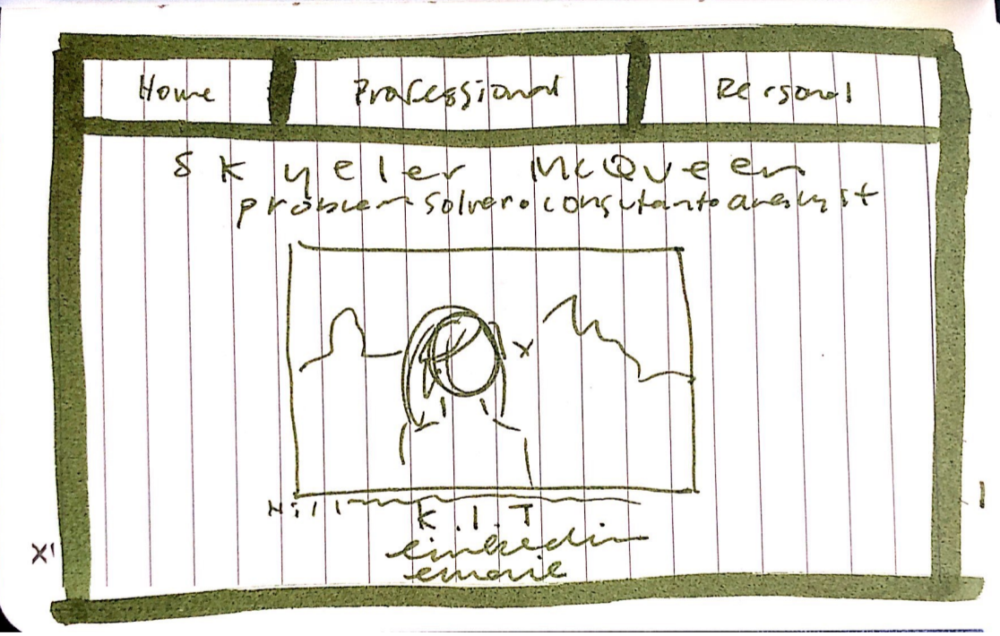

Above is the first sketch of my homepage, with a simple layout including a navigation bar, my name, an introduction to me, a photo of me, and my "keep in touch" section with my contact information. Everything is centered and linearly organized. The navigation stretches across the entire top of the page.

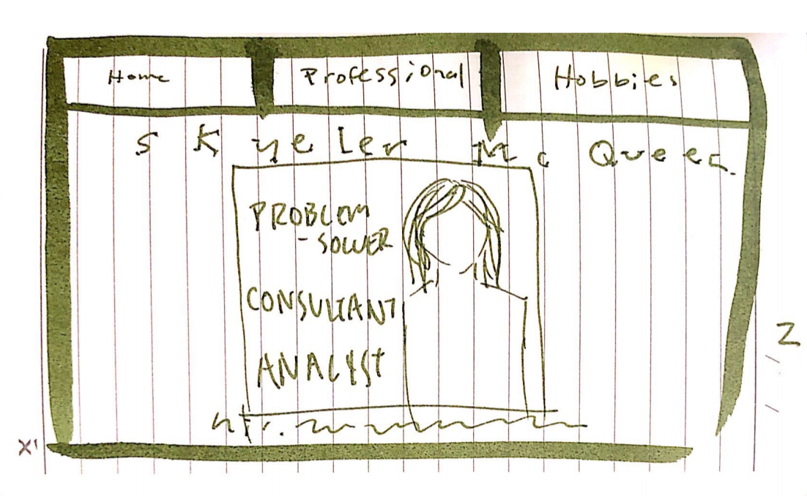

I wanted to play with the location of the introduction section, which were the words "problem-solver, consultant, analyst". I thought it might look cool if I overlayed them on the image of myself. The navigation and title stayed the same.

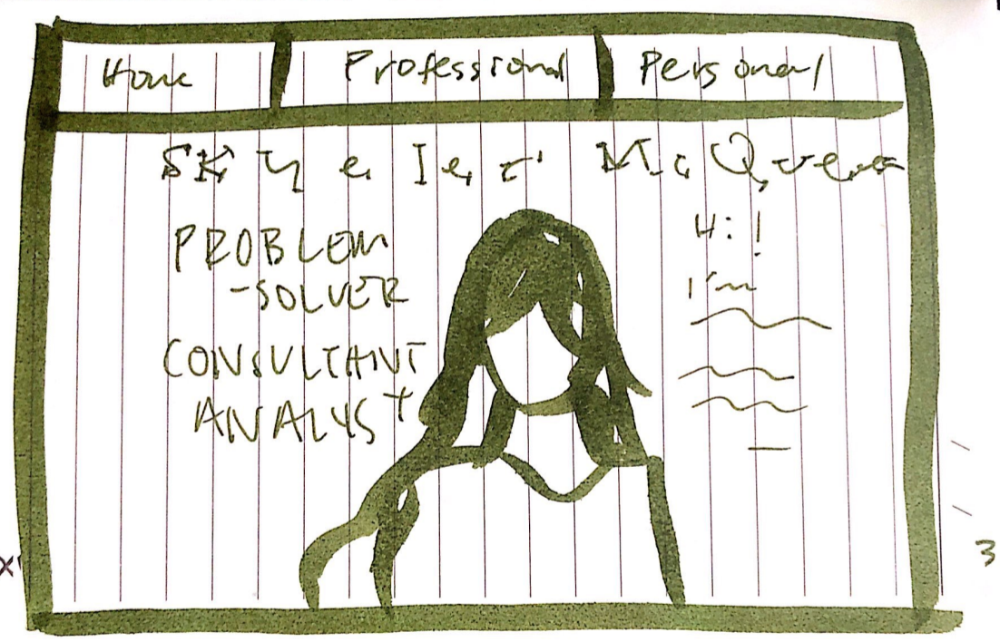

I continued to play with the location of the text and its relation to the picture. I thought about removing the background to the photo (so it just focused on me!) and putting my introduction phrases and my introductin paragraph in the white space around the image. The navigation and title stayed the same.

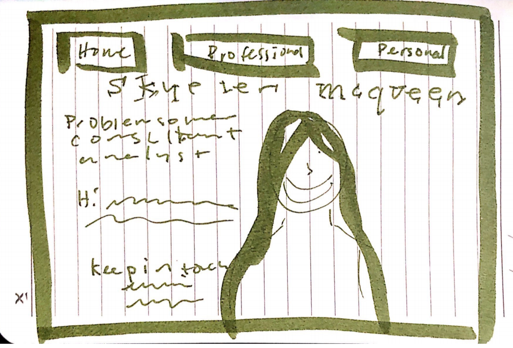

The navigation bar, with all of its color, was too distracting and not clean enough when it stretched all the way across the top of the page. Hence, I changed it so that there are three equal sized boxes with the links to the otehr pages on the website. I kept my name at the top and in the center, but I relocated all of my text to one side of the backgroundless image and made the image much bigger. I wanted things to look clean and more organized than having text on both sides of the image.

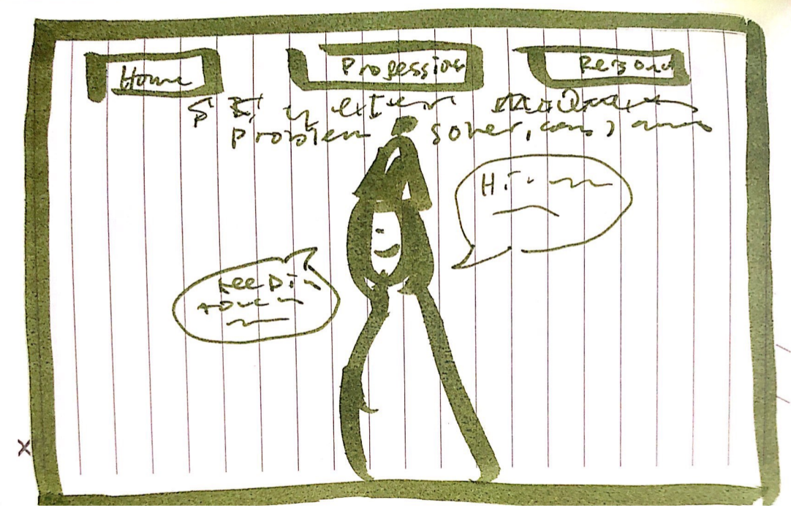

This was my final design for the homepage. I liked the navigation bar in the previous design, so I kept this in the final design. It was much less busy and easier to read than the longer navigation bar design. My name is centered, as it was before, but I also centered the three introduction-descriptors as well. I want to draw specific emphasis to those, as they are more important than the following text and let the user know who I am very quickly. I liked the image without the background, as it left more white space on the page and drew attention to the focal point of the image. I ended up adding speechbubble elements that I created in order to hold the introduction paragraph and the contact information. I wanted to organize this text into some sort of shape or element, as I felt it looked too loose and disorganized before. These speechbubble elements are also very fun and bold, which were the emotions I wanted to convey in this theme.

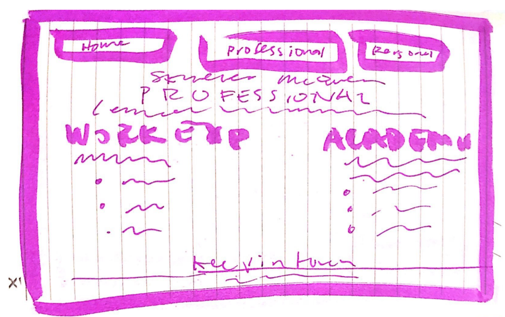

Above is the first sketch of my professional page. I used my final navigation bar design from the homepage, with my name on the bottom. The title of the page, Professional, is centered in the middle with two columns of text beneath it: titled "Work Experience" and "Academic Experience". These each contain bullet points with details about my experience. On the bottom of the page, there is a footer titled "Keep in Touch" with my contact information.

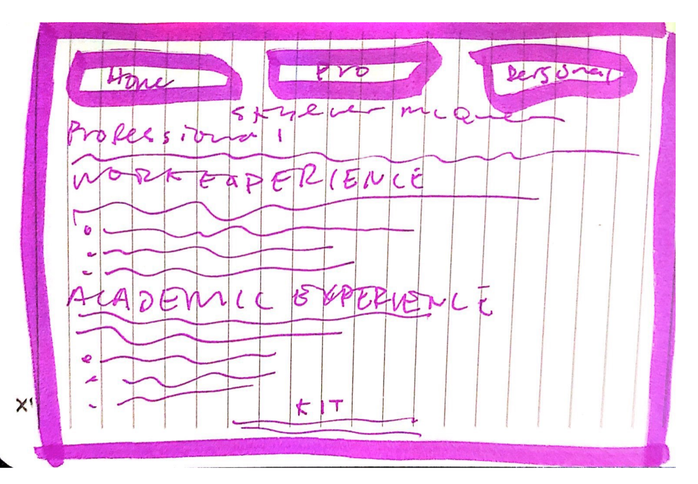

In my second draft sketch of this page, I kept the same navigation bar and footer. I thought the previous two columns were difficult to read, as there was too much text. This layout turned the columns into rows, that are left justified and stretch across the whole screen.

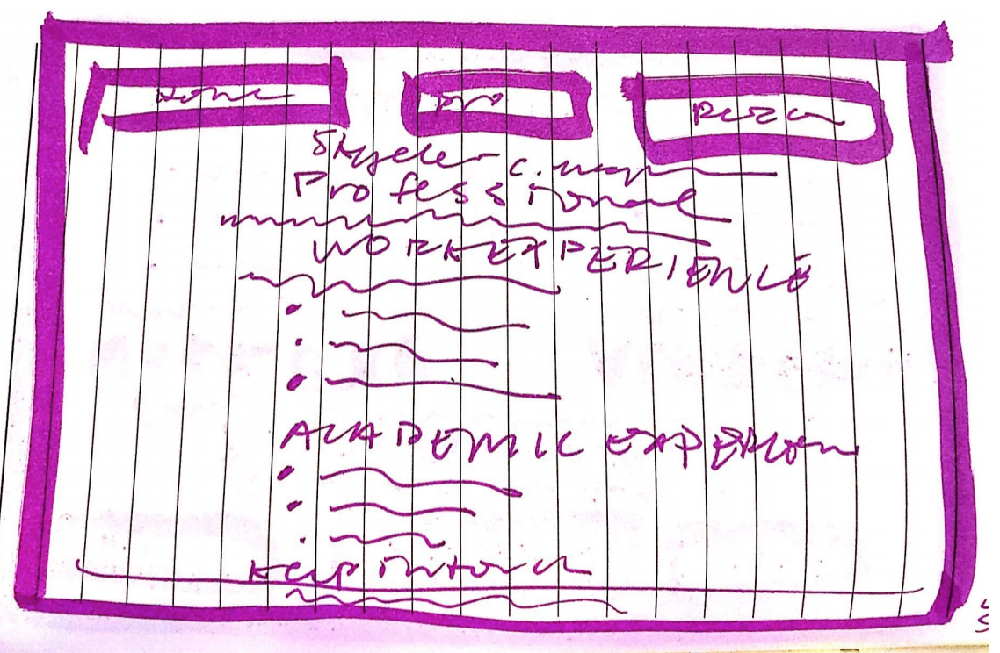

This is my final layout for my professional page. The navigation bar and footer are the same as before. I centered the text and limited the width, as I  thought the larger white space made it easier to read. The bulleted list is still left justified as it looks more organized that way. The audience would find this page easy to understand and read.

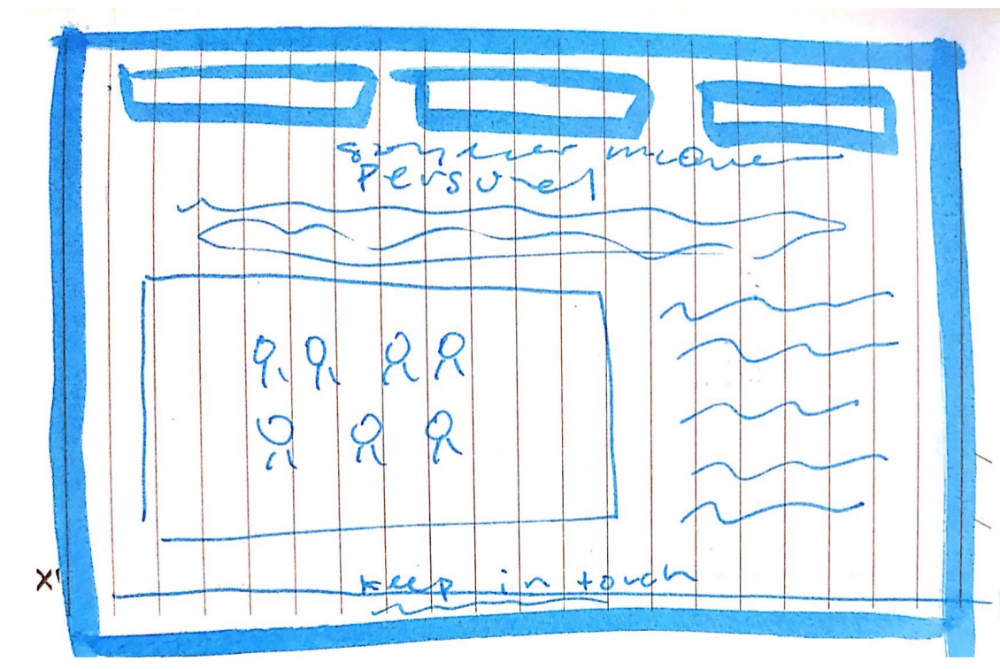

Above is my first sketch of my personal page. I had included a centered title and a left justified image with text wrapping around it. The sketch doesn't include the second image I planned on (my hiking picture), but I had planned to also left justify and text wrap as the shwon image. The footer and navigation panel are the same as the final ones for the other pages.

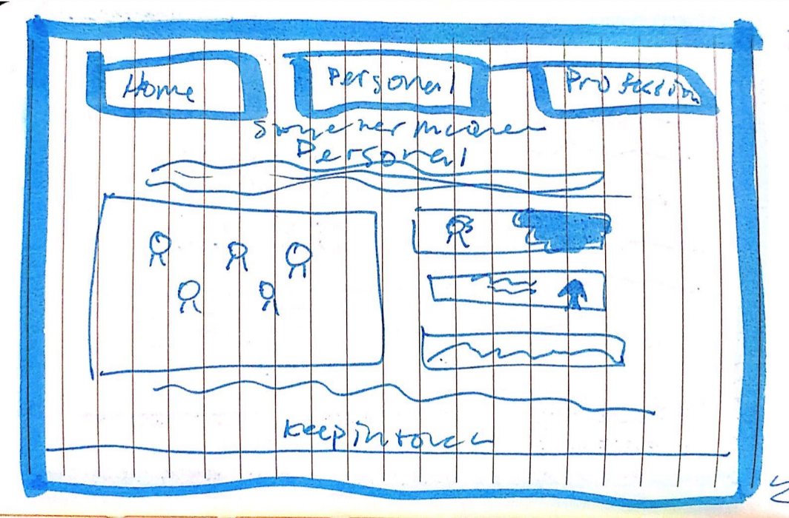

In the second draft, I decided to get rid of the text wrapping and add more images. A picture can speak louder than text, so I think that cutting down on words and adding more graphics makes the website look more organized. The images are organized in two columns, where the right most column has three stakced images. I also centered all of the text and the images, in order to make it easier to read. The navigation and footer are the same.

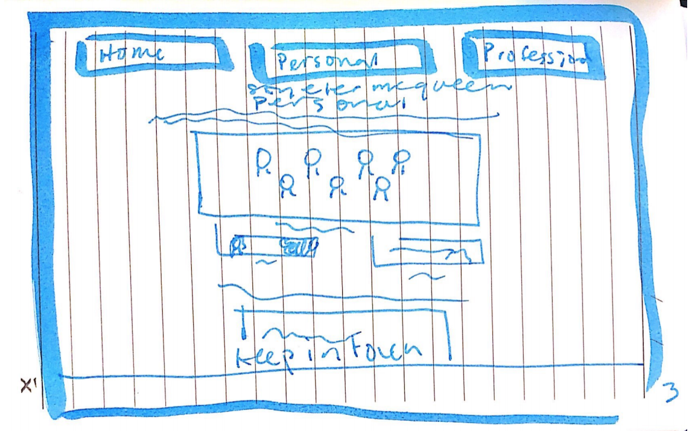

My third and final layout design for the personal page is very similar to the previous one. I cut down one of the images, as I thought that having five images on one page was overwhelming. I also switched the top set of images from two columns to two rows, where the bottom row has two graphics side by side. I also limited the width of the text and centered it, to leave more white space. This makes the page more readable and look organized. The audience will find this page easy to navigate and understand.

### Audience (Final Submission)
> A complete and polished description of the intended audience(s) for your website.

The audience for my website is potential employers, more specifically recruiters and interviewers who would be interested in hiring me. The industry I'm working in is technology consulting, so the potential employers would work for companies in the consulting field or related industries, for example the enterprise technology space. These people would be looking at my website to have an understanding of what my professional experience has been, what my professional interests are, what my academic background looks like, and my hobbies and interests. The audience will be looking to my website for a holistic view of me as person, in order to see if I would be a good fit for their company.

### Design Goals (Final Submission)
> An explanation of the design goals for that audience, based on your earlier rationales.

The main design purpose of my website is to be an advertisement for me as an employee. In order to achieve this greater purpose, the goals for my website are to be readable and well-organized, so that my audience of potential employers can easily find relevant information about me, as well as to be bold, creative, and fun, in order to show more of my personality while also maintaining a professional look to the design. These goals aim to make a cohesive, bold, professional, and easy to read website that shares a wholistic view of my professional and personal interests.

### Navigation (Final Submission)
> An explanation of how the final navigation met your goals and why its appropriate for your audience(s).

My final navigation bar meets all of my design goals. It is readable - the white text contrasts on the dark, bright colors of the background of each link. When the user hovers on the link element, the colors invert, which are still medium to high contrast and thus easy to read. There is also adequate padding and spacing between the colorful link elements in the navigation, which adds to the readability. The navigation is also well organized, as there are only three links and they are spaced adequately apart and inline with one and other. The organization and readability of the navigation are important for the audience, so they can easily find information. This is reflected in the titles of the pages - the home pafe is labelled as 'Home' professional as 'Professional', and personal as 'Personal'. The audience would find this appropriate as it is not difficult to find whatever information they are looking for. The colors of the navigation bar (green, pink, and blue) meet the goal of being bold. They are very fun and bright, but not overly so. This is appropriate for the audience as the colors show that I am a bold person, contributing to their holistic understanding of me as a potential employee. The font of the navigation elements contributes to the goal of being professional; the sans-serif font is easy to read, which is important for my audience, and simple.

### Organization (Final Submission)
> An explanation of how the final organization met your goals and why its appropriate for your audience(s).

My website is organized into three pages: the home page, professional page, and personal page. This is appropriate for my audience of potential employers as they could easily find anything they are looking for, from my work experience on the professional page and my extra-curricular interests and values on my personal page. My home page is organized with my name on the top, front and center, so that the audience can see the main topic of the webpage, so that it is easy to read and organized. Then a brief introduction and a photo of me are on the home page as well, which are boldly styled in speechbubbles, contributing to the bold theme of the webpage. It has been mentioned in class that a user decides whether they stay on a webpage after only a few seconds, so this page is organized in order to show the main topic of the website quickly, in a organized, readable, and fun way.

The professional page is organized with a blurb about my professional interests on top and then a list of my former positions. I wanted to include my work experience at the top of the page, as it is most relevant for my audience of potential employers. Beneath that section is my academic experience. Everything is organized with plenty of white space, in order to make it easy to read. The final page is my personal page, with information about volunteering and other hobbies. This is organized with a blurb about my volunteer experience and then some images from this experience beneath. This draws an easy connection between the blurb and the image, so it is easy to read and well organized. The audience will enjoy this as it is easy to find the personal content on the personal page and the first item on this page reflects my values. Beneath the volunteering section, there is a quick description of my other hobbies and an image of hiking. All of the content on this page is organized with plenty of white space, which makes it easy to read and find.

### Visual Design (Final Submission)
> An explanation of how the final design met your goals and why its appropriate for your audience(s).

My final design is bold, creative, fun, and easy to read, while still being professional. The background is an off-white color, which is less painful and bright than pure white but still contrasts heavily with the black, pink, blue, and green elements. The body text is all black, sans-serif which is bold and easy to read, especially with the white background. this is appropriate for my audience as it makes parsing through the content very easy. The headers are in bright green, pink, and blue, which are bold and creative colors while also high contrast and easy to read, making it professional. My final design also has different colors for the links in the text once you've clicked on them, making it easy for the audience to see when they've clicked on something or not.

All of the content on the website is centered, which makes it easy to find and read things. It also includes a lot of white space, which makes the website look clean and organized. The navigation has a hover element on the links, which inverts the color of the text and background. This is a creative and bold choice, but maintains readability. The home page has some of its body text inside of some speechbubble elements, which are fun and bold, hence appropriate for my audience because they communicate aspects of my personality.

### Self-Reflection (Final Submission)
> What did you learn from this assignment? What are some of your strengths and weaknesses?

I learned a lot about the changing design process while building this website. My intial vision of the project evolved and changed significantly from my first time imagining the website to the final project. I also learned just how much CSS can impact the aesthetic of the website. I had previously thought that CSS was just for fonts, colors, etc and that all of the content was structured in html. I was very wrong! Seeing the difference between my two themes on my website was shocking - they both had completely different feels to them. Some of my strengths on this project were coming up with ideas for colors, design, etc and referring to resources to come up with some cool things to add to my website (such as the hover element for links). Some of my weaknesses were documenting the design process and implementing my ideas in code. It took me about 3 hours in order to figure out how to do the speechbubbles with the text on my homepage. I also wish that I had screenshotted how my website looked throughout the design process, so that I could have included those screenshots in the write up.
